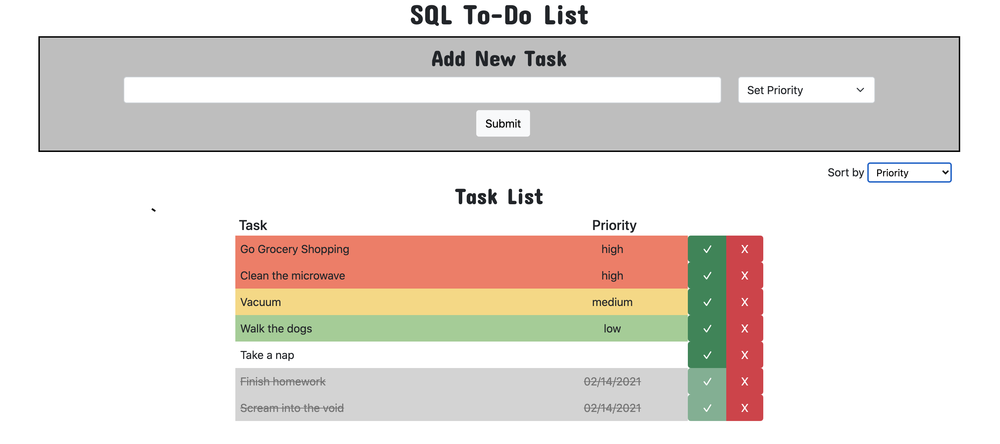

# PROJECT NAME

## Description

_Duration: 3 Day Sprint_

An app to store your to-do list in and check it off as you go!

To see the fully functional site, please visit: [DEPLOYED VERSION OF APP](www.heroku.com)

## Screen Shot

## Installation

Here is how you can get this app up and running on your computer:

1. Create a database named `weekend-to-do-app`,
2. The queries in the `database.sql` file are set up to create all the necessary tables and populate the needed data to allow the application to run correctly. The project is built on [Postgres](https://www.postgresql.org/download/), so you will need to make sure to have that installed. We recommend using Postico to run those queries as that was used to create the queries,
3. Open up your editor of choice and run an `npm install` to get all dependancies installed.
4. Run `npm start` in your terminal to start the server.
5. Open localhost:5000 in your browser.

## Usage

Here is how you use this app:

1. Start by adding any tasks you have in the input field at the top of the page. Select the priority (or don't; its up to you!) and then click 'Submit' to add it to your list.
2. Change the order of your active tasks by using the 'Sort by' dropdown.
3. As you complete tasks, click the green check mark. The task will turn grey and fall to the bottom of the list so you can see how much progress you've made.
4. If you need to delete any tasks, click the red X and then confirm the delete.
5. Take a break from your tasks and come back later. Your list will still be there!

## Built With

- HTML/CSS
- Javascript
- JQuery
- NPM
- Express
- SweetAlert
- Bootstrap

## Acknowledgement

Thanks to [Prime Digital Academy](www.primeacademy.io) who equipped and helped me to make this application a reality and my cat Scully for only stepping on the keyboard sometimes.

## Support

If you have suggestions or issues, please email me at [vada.karlen@gmail.com](vada.karlen@gmail.com)
